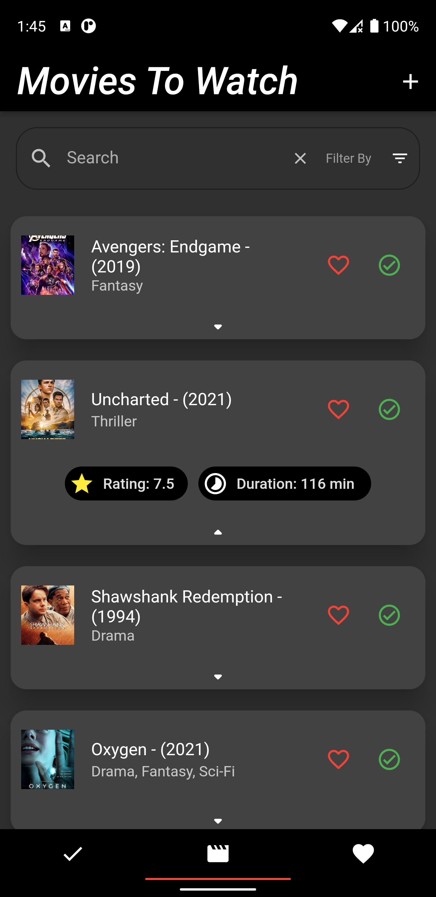
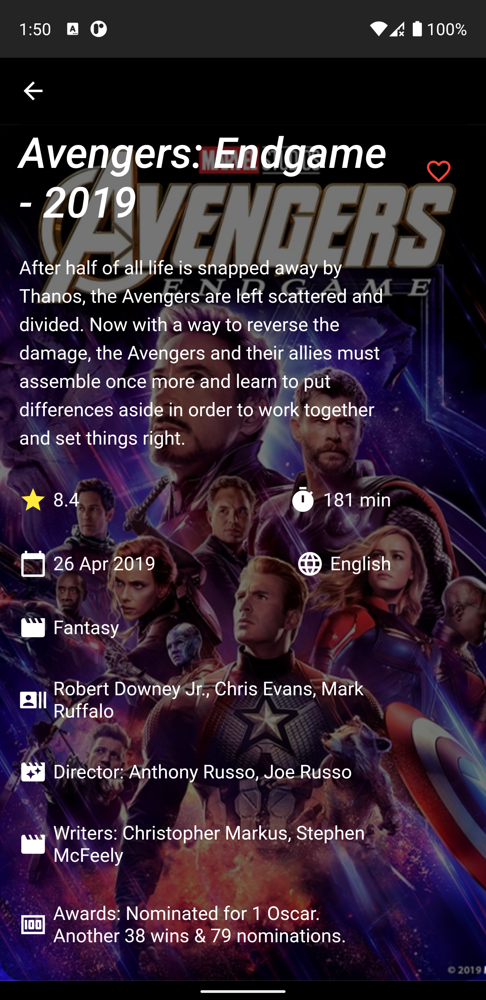
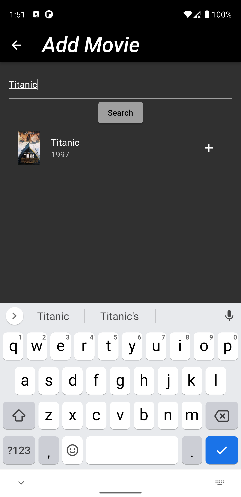

# Movie-App-Flutter

A movie app made using Flutter an sqflite local database. Here you can maintain your movie watchlist, your favorite movies and your seen movies.
This app is also a great way to learn/example of API fetching and making and displaying models of it.

## Developer:

<a href="https://github.com/Umar-Waseem">Umar Waseem</a>

## Guidelines To Contribute:

Just open a pull request if you would like to add something.
To open a pull request
- Click `fork` on the top right corner. An online copy of this repo will be made on your account.
- `Clone` the repository in you computer or just press "." button in your keyboard to open VS code Web.
- Do the changes you want to and `commit` them.
- Once you do these steps, you will see an option `"Compare & Pull Request"`, or you can just go to the parent repository and go to the pull requests section and make a pull request.
- Write about whatever changes you added.
- Wait for me to review your changes and merge the valid ones into the `master branch`.

"Something" can be:
- Code
- Comments
- Documentation
- New Features
- Issue Fixes

## Features:
- WatchList Movies / Series
- Favorite Movies
- Seen Movies
- Add New Movies
- Filtered Search Movies

## Upcoming Features
- Watch Movie Trailer

## Features In Consideration
- Watch the whole movie

## Api Used:
https://www.omdbapi.com/

## State Management:

- provider: ^6.0.3

## Packages Used:

- cupertino_icons: ^1.0.2
- provider: ^6.0.3
- http: ^0.13.5
- cached_network_image: ^3.2.2

## Screenshots:

